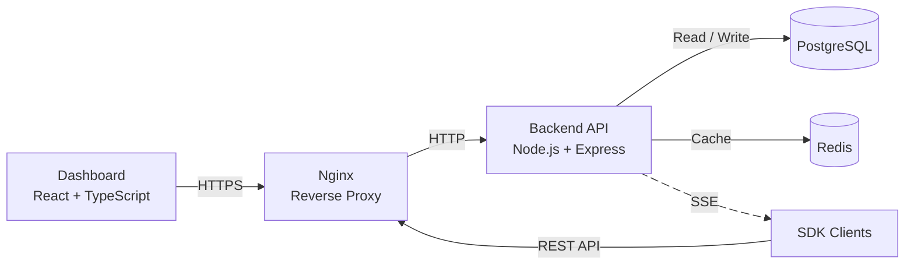
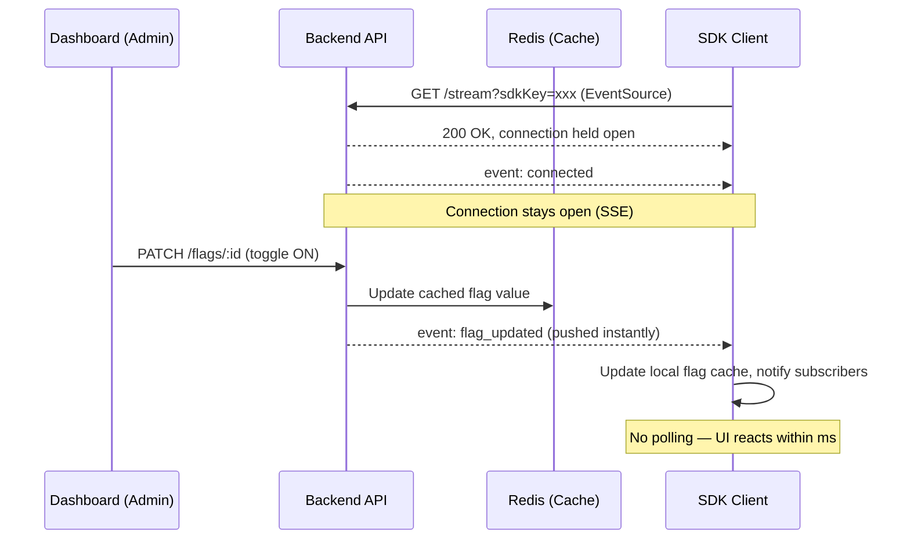
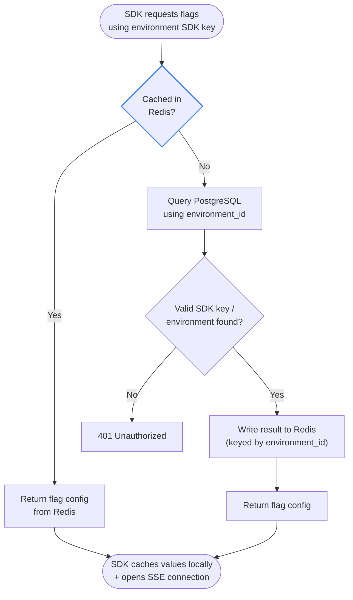
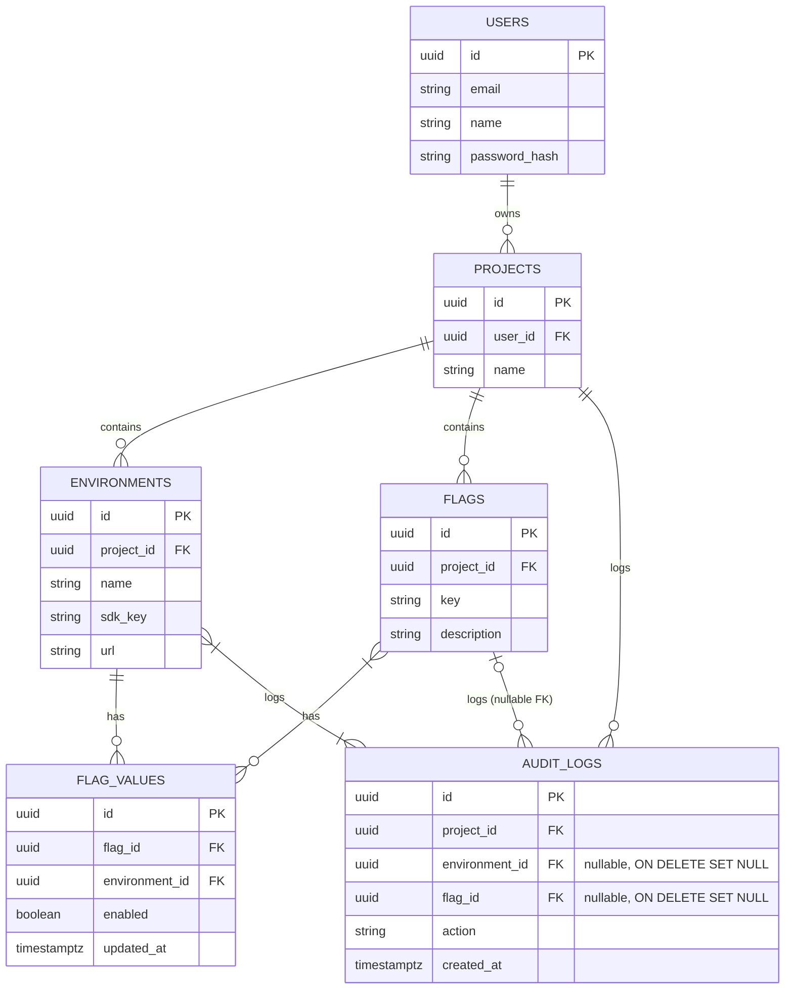

# FlagPulse

<p align="center">
  <strong>Feature flags without the deployment anxiety.</strong>
</p>

<p align="center">
  FlagPulse is a self-hosted feature flag management platform for controlling application behavior across environments, with real-time updates through Server-Sent Events.
</p>

<p align="center">
  <a href="#documentation">Documentation</a>
  ·
  <a href="#getting-started">Getting Started</a>
  ·
  <a href="#architecture">Architecture</a>
  ·
  <a href="#contributing">Contributing</a>
</p>

FlagPulse is licensed under the GNU General Public License v3.0.

---

## Overview

FlagPulse provides a central place to create, manage, and monitor feature flags across multiple projects and environments.

Instead of coupling feature releases directly to deployments, FlagPulse allows applications to retrieve their flag configuration through the SDK and receive changes in real time. The platform combines a management dashboard, API, PostgreSQL persistence, Redis caching, and an SSE-based update layer into a single deployable stack.

FlagPulse currently supports typed feature flags, environment-specific values, SDK key management, audit logging, caching, and real-time flag synchronization.

---

## Tech Stack

<p align="center">


</p>

| Layer             | Technology              | Purpose                                            |
| ----------------- | ----------------------- | -------------------------------------------------- |
| Dashboard         | React + TypeScript      | Feature flag management interface                  |
| Build Tool        | Vite                    | Frontend development and production build          |
| State Management  | Redux Toolkit           | Application and project state                      |
| Backend           | Node.js + Express       | REST API and server-side logic                     |
| Database          | PostgreSQL              | Persistent application data                        |
| Cache             | Redis                   | Flag and SDK key caching                           |
| Real-time Updates | Server-Sent Events      | Push flag changes to connected clients             |
| Authentication    | JWT + HTTP-only Cookies | User authentication and session handling           |
| Reverse Proxy     | Nginx                   | Serves the frontend and routes application traffic |
| Deployment        | Docker Compose          | Runs the complete FlagPulse stack                  |

---

## Core Features

| Feature            | Description                                                              |
| ------------------ | ------------------------------------------------------------------------ |
| Projects           | Organize feature flags and environments into separate projects           |
| Environments       | Manage independent environments with individual SDK keys                 |
| Typed Flags        | Create boolean, string, number, and JSON feature flags                   |
| Environment Values | Maintain flag state and configuration independently for each environment |
| Real-time Updates  | Propagate flag changes to connected SDK clients through SSE              |
| Redis Caching      | Cache flag configurations and SDK key lookups for faster access          |
| SDK Key Rotation   | Rotate environment SDK keys and invalidate the previous key              |
| Audit Logs         | Track project, environment, and flag changes                             |
| Authentication     | Register, login, logout, and protect management APIs                     |
| Project Isolation  | Associate management requests with the active FlagPulse project          |
| Docker Deployment  | Run the dashboard, backend, PostgreSQL, Redis, and Nginx together        |

---

## How FlagPulse Works

At a high level, FlagPulse separates **flag management** from **flag consumption**.

The dashboard communicates with the backend to manage projects, environments, and flags. The backend persists configuration in PostgreSQL while Redis is used as a cache layer. Applications using the SDK authenticate using an environment-specific SDK key, retrieve their flags, and maintain a real-time SSE connection for subsequent updates.

### Architecture


## Flag Lifecycle

A flag belongs to a project and receives an environment-specific value for every environment associated with that project.

The flag definition contains its key, name, type, default value, and description. The environment-specific value controls whether the flag is enabled and stores additional configuration for that environment.

| Flag Type | Example Value     | Typical Use                         |
| --------- | ----------------- | ----------------------------------- |
| `boolean` | `true`            | Enable or disable a feature         |
| `string`  | `"new-dashboard"` | Change text or configuration values |
| `number`  | `50`              | Numeric configuration               |
| `json`    | `{ ... }`         | Structured configuration            |

The underlying data model separates the flag definition from its environment-specific values, allowing the same flag to behave differently across environments.

---

## Real-Time Updates

FlagPulse uses **Server-Sent Events (SSE)** to propagate changes from the platform to connected SDK clients.

When a flag is updated, the backend updates the corresponding environment value, updates or invalidates the Redis cache, records the change in the audit log, and publishes an SSE event for the affected environment.

This allows connected clients to react to flag changes without repeatedly polling the API. The dashboard's SDK usage preview also reflects the intended real-time SSE-based consumption model.



---

## SDK Request Flow

The SDK uses an environment-specific SDK key to retrieve the flags belonging to that environment.

Flag retrieval follows a cache-first approach. The backend first attempts to resolve the SDK key and flag configuration through Redis before falling back to PostgreSQL when the required data is not cached.

This keeps frequently accessed flag configuration away from the database while still allowing the database to remain the source of truth.



---

## Data Model

FlagPulse uses PostgreSQL as its persistent data store.

| Entity         | Responsibility                                           |
| -------------- | -------------------------------------------------------- |
| `users`        | Stores authenticated users                               |
| `projects`     | Stores FlagPulse projects                                |
| `environments` | Stores environments and their SDK keys                   |
| `flags`        | Stores flag definitions                                  |
| `flag_values`  | Stores environment-specific flag configuration           |
| `audit_logs`   | Stores changes made to projects, environments, and flags |

The relationship between flags and environments is represented through `flag_values`, allowing each environment to maintain its own state for the same feature flag. The schema also supports rollout percentage and targeting-related fields at the data-model level.



---

## Dashboard

The FlagPulse dashboard provides the management interface for projects and their feature flags.

The current dashboard is organized around projects, flags, environments, audit logs, and settings, with project switching available from the main navigation.

| Section      | Purpose                                                    |
| ------------ | ---------------------------------------------------------- |
| Projects     | Create and switch between projects                         |
| Flags        | Create, inspect, update, enable, disable, and delete flags |
| Environments | Manage environments and SDK keys                           |
| Audit Log    | Review project, environment, and flag changes              |
| Settings     | Manage application-level settings                          |
| Create Flag  | Define new feature flags and their default values          |

---

## Audit Logging

FlagPulse records important management actions so changes can be traced back to their source.

Supported audit events include:

* Project creation
* Environment creation and deletion
* Flag creation, update, toggle, and deletion
* SDK key rotation

Audit records retain information such as the project, flag, environment, user, previous value, new value, change type, and timestamp.

---

## Security

FlagPulse uses several layers of application security:

| Area                    | Implementation                      |
| ----------------------- | ----------------------------------- |
| Authentication          | JWT                                 |
| Session Storage         | HTTP-only cookie                    |
| Password Security       | bcrypt                              |
| API Protection          | Authentication middleware           |
| SDK Authentication      | Environment-specific SDK key        |
| SDK Key Rotation        | Previous key invalidation           |
| CORS                    | Project/environment origin handling |
| Sensitive Configuration | Environment variables               |

User authentication tokens are issued as HTTP-only cookies, while protected project, environment, and flag routes require authentication.

SDK keys can also be rotated from the environment management interface, invalidating the existing key and requiring connected clients to switch to the new key.

---

## Project Structure

```text
flagpulse/
├── backend/
│   ├── config/
│   ├── controllers/
│   ├── db/
│   │   └── migrations/
│   ├── middleware/
│   ├── model/
│   ├── routes/
│   ├── services/
│   └── utils/
│
├── frontend/
│   └── src/
│       ├── app/
│       ├── components/
│       ├── features/
│       ├── pages/
│       ├── routes/
│       └── services/
│
├── nginx/
│   └── nginx.conf
│
├── docker-compose.yml
├── .env.example
└── .dockerignore
```

## Getting Started

### Prerequisites

Make sure the following are installed:

* Docker
* Docker Compose

### Configuration

Create an environment file from the provided example:

```bash
cp .env.example .env
```

Configure the required database, JWT, and exposed port values:

```env
DB_USER=
DB_PASSWORD=
DB_NAME=

JWT_SECRET=

PORT=
```

These variables are consumed by the Docker Compose services and backend configuration.

### Run FlagPulse

Start the complete stack with:

```bash
docker compose up --build
```

The backend automatically runs database migrations before starting the server. PostgreSQL and Redis run as separate services, while the frontend is served through Nginx.

### Services

| Service    | Technology        | Role                              |
| ---------- | ----------------- | --------------------------------- |
| `postgres` | PostgreSQL 16     | Persistent database               |
| `redis`    | Redis 7           | Cache and temporary state         |
| `backend`  | Node.js + Express | API and real-time services        |
| `nginx`    | Nginx             | Frontend server and reverse proxy |

All services communicate through the dedicated `flagpulse_net` Docker network, with persistent volumes for PostgreSQL and Redis data.

---

## API

FlagPulse exposes separate API surfaces for authentication, project management, environment management, flag management, SDK access, and real-time streaming.

| API Area       | Base Path           |
| -------------- | ------------------- |
| Authentication | `/api/auth`         |
| Projects       | `/api/projects`     |
| Environments   | `/api/environments` |
| Flags          | `/api/flags`        |
| SDK            | `/api/v1`           |
| SSE            | `/api/v1/stream`    |

The backend mounts the SDK and SSE endpoints separately from the authenticated dashboard API routes.

---

## Documentation

Full documentation:

**[FlagPulse Documentation](https://flagpulse.h208.me/)**

---

## Roadmap

| Area                   | Status             |
| ---------------------- | ------------------ |
| Project management     | Implemented        |
| Environment management | Implemented        |
| Typed feature flags    | Implemented        |
| SDK key management     | Implemented        |
| Redis caching          | Implemented        |
| SSE updates            | Implemented        |
| Audit logging          | Implemented        |
| Docker deployment      | Implemented        |
| Percentage rollouts    | Data model present |
| Targeting              | Data model present |

---

## Contributing

Contributions are welcome.

If you would like to contribute to FlagPulse, start by opening an issue to discuss the change or submit a pull request with a clear description of the problem and implementation.

For larger changes, it is recommended to discuss the proposed architecture before implementation.

---

## License

This project is licensed under the **ISC License**.

---

## Author

**N Hithesh Kumar**

Built with Node.js, React, PostgreSQL, Redis, Docker, and a lot of feature flags.
